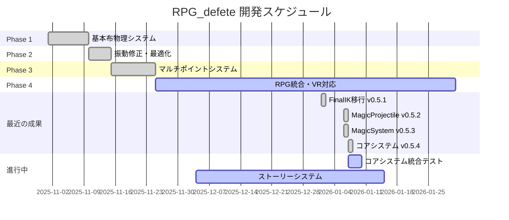

# プロジェクトステータス

最終更新: 2026-01-07 (v0.5.4)

---

## プロジェクト概要

| 項目 | 内容 |
|------|------|
| プロジェクト名 | RPG_defete |
| 会社名 | DefaultCompany |
| Unity バージョン | 6000.0.46f1 |
| レンダーパイプライン | Universal Render Pipeline (URP) v17.0.4 |
| プロジェクトタイプ | RPG with Advanced Cloth Physics |
| 現在のバージョン | v0.5.4 |
| 開発段階 | RPG統合・コアシステム実装 |

---

## 📊 進捗サマリー

| 指標 | 値 |
|------|-----|
| 全体進捗 | **83%** |
| 完了タスク | 27個 |
| 進行中 | 2個 |
| 未着手 | 5個 |
| 完了フェーズ | Phase 1-3 (Cloth Physics), VRoid Acting System |
| 現在フェーズ | Phase 4: RPG統合・コアシステム統合テスト |

### 📅 開発スケジュール



---

## 現在の開発フォーカス

### MagicaCloth2 布物理システム

本プロジェクトは、MagicaCloth2を使用した「つかめる布」のテストと改造を中心に進行中です。

#### 主要機能

1. **マルチポイント頂点グラビングシステム** (`ClothVertexGrabber.cs`)
   - 複数のグラブポイントによる同時制御
   - 各グラブポイントに個別の頂点制約設定
   - Fixed頂点の除外による振動防止
   - OnPreSimulation、OnPostSimulation、Camera.onPreRenderによるスムーズなグラビング

2. **コライダーベースのグラビングシステム** (`ClothGrabber.cs`)
   - 2つの球体コライダーで布を挟んでグラブ
   - 動的なコライダー生成・削除

3. **グラブポイント移動制御** (`GrabPointMover.cs`)
   - グラブポイントの位置制御

---

## 📊 開発進捗

### ✅ 完了した実装

#### v0.1.0 (初期実装)
- [x] Unity MRプロジェクトセットアップ
- [x] MagicaCloth2統合
- [x] 基本的な頂点グラビングシステム

#### v0.2.0 (振動修正)
- [x] Camera.onPreRenderを使用した振動修正
- [x] ダイレクトメッシュコントロールの実装

#### v0.3.0 (マテリアル改善)
- [x] 両面光沢布シェーダー追加
- [x] マテリアル設定の最適化

#### v0.4.0 (マルチポイントシステム)
- [x] マルチポイント頂点グラビングシステム実装
- [x] 個別頂点制約機能
- [x] 複数グラブポイントの同時制御
- [x] Fixed属性による振動防止の強化

#### v0.4.1 (座標系修正)
- [x] cape2移動時の座標系問題を修正
- [x] 初期ClothTransform座標系を記録・使用
- [x] `WorldToInitialClothLocal()` / `InitialClothLocalToWorld()` ヘルパーメソッド追加
- [x] RandomGrabPointMoverスクリプト作成（テスト用）

#### v0.4.2 (視覚的頂点選択ツール)
- [x] ClothVertexGrabberEditor カスタムエディタ実装
- [x] Scene viewでの頂点可視化（色分け表示）
- [x] マウスクリックによる頂点選択機能
- [x] GrabPoint別の色分け（赤/緑/青/黄/マゼンタ）
- [x] Inspector UIでの選択モード切り替え
- [x] Shift/Ctrl修飾キーによる追加/削除

#### v0.4.3 (頂点割り当て永続化)
- [x] VertexAssignmentData ScriptableObject実装
- [x] Playモード終了時の自動保存機能
- [x] Playモード開始時の自動ロード機能
- [x] Inspector UIでの手動保存/ロードボタン
- [x] 保存ステータス表示（最終保存時刻、割り当て頂点数）
- [x] `Assets/Editor/ClothVertexAssignments.asset`への永続化

#### v0.4.4 (外部制御API)
- [x] ClothVertexGrabberに外部制御用公開API追加
- [x] インデックスと名前による制御メソッド実装
- [x] アニメーションイベント対応
- [x] ClothGrabControllerサンプルスクリプト作成
- [x] APIガイドドキュメント作成（`.tmp/cloth_grab_api_guide.md`）
- [x] アニメーション統合のためのToggle機能
- [x] グラブ状態確認メソッド追加

#### v0.4.5 (振動軽減・パフォーマンス)
- [x] 周辺頂点も一緒にグラブする機能実装（振動軽減）
- [x] メッシュトライアングルから頂点接続情報を構築
- [x] `includeNeighborVertices`オプション追加（デフォルト: true）
- [x] `neighborDepth`パラメータ追加（1-3で調整可能）
- [x] 隣接頂点の自動検出アルゴリズム実装
- [x] SimplePerformanceMonitorスクリプト作成（FPS監視）
- [x] パフォーマンス分析ドキュメント作成

#### v0.4.6 (永続化改善)
- [x] Playモード終了時の自動保存を廃止
- [x] 手動保存のみに変更（意図しない上書き防止）

#### v0.4.7 (頂点オフセット修正)
- [x] 頂点位置のオフセット問題を修正
- [x] 強制的な物理パラメータ設定を削除

#### v0.4.8 (OrbitOscillator)
- [x] 球面経線振動（spherical meridian oscillation）のためのOrbitOscillatorスクリプト追加

#### v0.4.9 (ランタイムビルド対応)
- [x] ランタイムビルドで頂点割り当てが動作しない問題を修正

#### v0.4.10 (chara_test)
- [x] キャラクターテスト用シーン（chara_test）追加
- [x] チュートリアルドキュメント追加

#### v0.5.0 (VRoid Character Acting System) - **最新**

**Phase 1: VRM Expression Controller**
- [x] VRMExpressionController.cs 作成
- [x] ExpressionCommand.cs 作成
- [x] StoryContext/StoryCommandData 拡張
- [x] ExpressionTester.cs 作成

**Phase 2: Animation Controller + NavMesh Movement**
- [x] VRMAnimationController.cs 作成
- [x] CharacterNavigator.cs 作成
- [x] PoseCommand.cs / MoveCommand.cs 作成
- [x] AnimationMoveTester.cs 作成
- [x] CombatAnimator対応（Speed パラメータ）

**Phase 3: IK System (Animation Rigging)**
- [x] Animation Rigging パッケージ追加 (v1.3.0)
- [x] VRMRigSetup.cs 作成（Rig構造自動生成）
- [x] VRMIKController.cs 作成（LookAt/Hand/Foot/Hip IK制御）
- [x] LookAtCommand.cs / HandIKCommand.cs / FootIKCommand.cs / HipIKCommand.cs / IKControlCommand.cs 作成
- [x] IKTester.cs 作成
- [x] StoryPlayer.cs にIKコマンド登録

#### v0.5.1 (FinalIK移行) - 2026-01-01
- [x] Animation RiggingからFinalIKへ移行
- [x] VRMFinalIKController.cs作成（FullBodyBipedIK + LookAtIK使用）
- [x] IKTester.csをFinalIK対応に更新
- [x] 全IK機能（LookAt/Hand/Foot/Body）動作確認完了
- [x] VRM10視線制御（Eye Gaze）実装（VRMEyeGazeController.cs）

#### v0.5.2 (MagicProjectile) - 2026-01-06
- [x] MagicProjectileの衝突検出・ダメージ適用テスト完了
- [x] TestEnemyへの25ダメージ/発を確認

#### v0.5.3 (MagicSystem) - 2026-01-06
- [x] MagicSystem.cs作成（Player/Enemy共通魔法発射ファサード）
- [x] EnemyMagicController.cs作成（Enemy用魔法制御）
- [x] SkillDataCreator.cs作成（テスト用スキル作成エディタ）

#### v0.5.4 (コアシステム) - 2026-01-07 **最新**
- [x] MouseInputController.cs（右クリ移動/左クリアクション）
- [x] GameCharacter.cs（HP/感情/VRM統合）
- [x] InteractionPoint.cs（インタラクションポイント）
- [x] OrbitCamera.cs（障害物回避/フォーカス）
- [x] InteractableObject.cs（属性フラグ/サイズ分類）
- [x] ActionSystem.cs（ActionBase/ActionExecutor）
- [x] BasicActions.cs（8種類の基本アクション：Attack/Magic/Grab/Touch/Talk/Sit/Kiss/Look）

### ✅ Phase 3 IKシステムテスト完了 (2025-12-31)

**テスト結果:**

| IK機能 | Weight変化 | 動作 | 備考 |
|--------|----------|------|------|
| Hand IK (5キー) | ✅ | ✅ 動作 | TwoBoneIKConstraint |
| Foot IK (6キー) | ✅ | ✅ 動作 | TwoBoneIKConstraint |
| LookAt (4キー) | ✅ | ⚠️ 要調整 | aimAxis設定調整必要 |
| Hip IK (7キー) | ✅ | ⚠️ 要調整 | MultiPositionConstraint調整必要 |

**修正内容:**
- VRMRigSetup: Rig.weight=1, Constraint.weight=0 に変更
- VRMRigSetup: aimAxisをZ_NEGに変更、maintainOffset追加
- IKTester/VRMIKController: デバッグログ追加

### 📋 今後の調整項目

1. **LookAt改善**: VRMモデルの頭ボーンの向きに合わせたaimAxis設定
2. **Hip IK改善**: MultiPositionConstraint設定の見直し

### 🚧 現在の課題

- グラブ時の振動完全解消（MagicaCloth2パラメータ調整で改善可能）
- VRコントローラー統合（現在はキーボード入力）
- RPGゲームプレイへの統合

### ✅ 解決済みの課題

- ~~cape2移動後に頂点がgrabpointからずれる問題~~ → v0.4.1で解決
- ~~VRMRigSetup/VRMIKControllerコンパイルエラー~~ → v0.5.0で解決

### ⏳ 今後の予定 (Phase 4)

| 優先度 | タスク | 状態 |
|--------|--------|------|
| 🔴 High | コアシステム統合テスト (task-009) | 🚧 進行中 |
| 🔴 High | ストーリー・メッセージウィンドウシステム (task-006) | 🚧 進行中 |
| 🔴 High | VRコントローラー入力対応 (task-001) | ⏳ 未着手 |
| 🔴 High | パフォーマンス最適化 (task-002) | ⏳ 未着手 |
| 🟡 Medium | RPGキャラクターシステム統合 (task-003) | ⏳ 未着手 |
| 🟡 Medium | 布グラビング活用ゲームプレイ (task-004) | ⏳ 未着手 |
| 🟢 Low | マルチプレイヤー対応検討 (task-005) | ⏳ 未着手 |

---

## プロジェクト構造

```
RPG_defete/
├── Assets/
│   ├── Scenes/
│   │   ├── SampleScene.unity          # メインシーン
│   │   ├── game1.unity                # ゲームシーン1
│   │   ├── Big_Scene.unity            # 大規模シーン
│   │   └── cloth_test.unity           # 布物理テストシーン
│   ├── Scripts/
│   │   ├── Cloth Physics/
│   │   │   ├── ClothVertexGrabber.cs  # マルチポイント頂点グラビング
│   │   │   ├── ClothGrabber.cs        # コライダーベースグラビング
│   │   │   ├── GrabPointMover.cs      # グラブポイント制御
│   │   │   ├── RandomGrabPointMover.cs # グラブポイントランダム移動（テスト用）
│   │   │   └── ClothGrabController.cs # アニメーション連携用コントローラ
│   │   ├── Debug/
│   │   │   └── SimplePerformanceMonitor.cs # FPS/パフォーマンスモニター
│   │   ├── RPG Core/
│   │   │   ├── PlayerController.cs    # プレイヤー制御
│   │   │   ├── PlayerAttack.cs        # プレイヤー攻撃
│   │   │   ├── EnemyController.cs     # 敵AI
│   │   │   ├── EnemySpawner.cs        # 敵スポーン
│   │   │   ├── Projectile.cs          # 発射物
│   │   │   ├── GameManager.cs         # ゲーム管理
│   │   │   ├── UIManager.cs           # UI管理
│   │   │   └── ObjectPool.cs          # オブジェクトプール
│   │   └── Testing/
│   │       ├── TestScript1.cs
│   │       └── TestScript2.cs
│   ├── Editor/
│   │   ├── ClothVertexGrabberEditor.cs # 頂点選択ツール（CustomEditor）
│   │   ├── VertexAssignmentData.cs     # 頂点割り当てデータ（ScriptableObject）
│   │   └── ClothVertexAssignments.asset # 頂点割り当て保存ファイル
│   ├── Materials/                     # マテリアル（両面光沢布など）
│   ├── Prefabs/                       # プレハブ
│   └── Settings/                      # URP設定
├── Packages/                          # Unityパッケージ
│   └── manifest.json
├── .claude/                           # Claude Code設定
│   ├── CLAUDE.md
│   ├── PROJECT_STATUS.md              # このファイル
│   └── tasks.json                     # タスク管理
└── .vscode/                           # VS Code設定
```

---

## 技術スタック

### レンダーパイプライン
- **Universal Render Pipeline (URP) v17.0.4**

### 布物理
- **MagicaCloth2** - 高度な布物理シミュレーション
  - VertexAttribute制御
  - MagicaManagerイベントシステム
  - ダイレクトメッシュコントロール

### インストール済みパッケージ

#### コア機能
- `com.unity.render-pipelines.universal` v17.0.4 - URP
- `com.unity.inputsystem` v1.14.2 - 新入力システム
- `com.unity.timeline` v1.8.9 - タイムライン
- `com.unity.visualscripting` v1.9.7 - ビジュアルスクリプティング
- `com.unity.ugui` v2.0.0 - UI システム

#### AI/ナビゲーション
- `com.unity.ai.navigation` v2.0.9 - AI ナビゲーション

#### 開発ツール
- `com.unity.test-framework` v1.6.0 - テストフレームワーク
- `com.unity.package-validation-suite` v0.22.0-preview - パッケージ検証

#### IDE統合
- `com.unity.ide.rider` v3.0.38 - JetBrains Rider
- `com.unity.ide.visualstudio` v2.0.25 - Visual Studio

#### カスタムパッケージ
- `com.coplaydev.unity-mcp` - Unity MCP (Model Context Protocol)
  - GitHub: https://github.com/CoplayDev/unity-mcp.git

---

## 主要スクリプト概要

### ClothVertexGrabber.cs (v0.4.10)

**マルチポイント頂点グラビングシステム（振動軽減機能付き）**

#### 主要機能
- 複数のグラブポイントを同時に制御
- 各グラブポイントに個別の頂点インデックス制約
- **周辺頂点も一緒にグラブして振動を軽減**（v0.4.5新機能）
- Fixed属性設定による振動防止
- 3つのイベントフックによるスムーズな制御：
  - `OnPreSimulation`: グラブした頂点の位置更新
  - `OnPostSimulation`: 表示位置の強制更新
  - `Camera.onPreRender`: レンダリング直前のメッシュ制御

#### GrabPointInfo クラス
```csharp
- name: グラブポイント名
- transform: グラブポイントのTransform
- keyCode: グラブ操作のキー
- allowedVertexIndices: グラブ可能な頂点インデックスのリスト（空の場合は全頂点）
- maxGrabbedVertices: 最大グラブ頂点数
- includeNeighborVertices: 周辺頂点も含めるか（デフォルト: true）【v0.4.5新機能】
- neighborDepth: 隣接頂点の深さ（1-3、デフォルト: 1）【v0.4.5新機能】
```

#### 使用方法
1. MagicaClothコンポーネントをアサイン
2. グラブポイント（Transform）を設定
3. 各グラブポイントにキーを割り当て
4. 必要に応じて`allowedVertexIndices`で制約を設定
5. プレイモードでキーを押してグラブ

---

## MagicaCloth2 統合のベストプラクティス

### 初期化
- `MagicaCloth.IsValid()`でクロスの準備完了を確認
- `TeamId`の取得と保持

### 頂点制御
```csharp
// 頂点をグラブ時: Fixed属性に変更
attributes[vertexIndex] = VertexAttribute.Fixed;

// リリース時: 元の属性に復元
attributes[vertexIndex] = originalAttribute;
```

### イベントフック
```csharp
MagicaManager.OnPreSimulation += UpdateGrabbedVertices;
MagicaManager.OnPostSimulation += ForceUpdateDisplayPositions;
Camera.onPreRender += OnCameraPreRender;
```

### 振動防止
- Fixed属性の頂点は制約計算から除外される
- `Camera.onPreRender`でダイレクトメッシュ制御を行い、レンダリング前に位置を確定

---

## 開発ガイドライン

### コーディング規則
- Unity の `[SerializeField]` でインスペクター公開
- MagicaManagerのイベントシステムを活用
- `null`チェックを確実に実行
- XML ドキュメントコメントを記載

### MagicaCloth2使用時の注意
- クロスの初期化を待ってからプロパティにアクセス
- Fixed属性に変更した頂点は、リリース時に必ず元の属性に復元
- `Camera.onPreRender`は登録/解除を確実に行う（メモリリーク防止）

---

## Git履歴

最近のコミット:
```
[latest] - Fix coordinate system issue when cape2 moves (v0.4.1)
30ff029 - Add multi-point vertex grabbing system with individual constraints
fe09cb0 - Fix cloth vertex vibration using Camera.onPreRender
dedc590 - Add double-sided glossy cloth shader and materials
5ce21e1 - Initial commit: Unity MR project with MagicaCloth2 vertex grabbing
```

---

## 参考リンク

- [MagicaCloth2 Documentation](https://magicasoft.jp/magica-cloth-2/)
- [Unity MCP GitHub](https://github.com/CoplayDev/unity-mcp)
- [Unity URP Documentation](https://docs.unity3d.com/Packages/com.unity.render-pipelines.universal@latest)

---

## 更新履歴

| 日付 | 内容 |
|------|------|
| 2025-11-25 | プロジェクトステータス初期作成（実態に合わせて更新） |
| 2025-11-25 | v0.4.1リリース（cape2移動時の座標系問題修正、RandomGrabPointMover追加） |
| 2025-11-25 | v0.4.2リリース（視覚的頂点選択ツール実装、ClothVertexGrabberEditor追加） |
| 2025-11-25 | v0.4.3リリース（頂点割り当て永続化システム、ScriptableObject実装） |
| 2025-11-25 | v0.4.4リリース（外部制御API追加、アニメーション連携対応、ClothGrabController実装） |
| 2025-11-25 | v0.4.5リリース（周辺頂点グラブ機能で振動軽減、パフォーマンスモニター追加） |
| 2025-11-26 | v0.4.6リリース（頂点割り当て永続化を手動保存のみに変更） |
| 2025-11-27 | v0.4.7リリース（頂点位置オフセット修正） |
| 2025-11-28 | v0.4.8リリース（OrbitOscillatorスクリプト追加） |
| 2025-11-30 | v0.4.9リリース（ランタイムビルド頂点割り当て修正） |
| 2025-12-03 | v0.4.10リリース（chara_testシーン、チュートリアル追加） |
| 2025-12-29 | 進捗レポート更新、Mermaidガントチャート追加 |
| 2025-12-31 | v0.5.0リリース（VRoid Character Acting System Phase 1-3完了） |
| 2025-12-31 | tasks.json更新（VRoid Acting System Phase 1-3完了タスク追加）、進捗メトリクス更新 |
| 2026-01-01 | v0.5.1リリース（FinalIKへの移行完了）|
| 2026-01-01 | VRM10視線制御（Eye Gaze）実装完了 |
| 2026-01-06 | v0.5.2リリース（MagicProjectile動作テスト完了）|
| 2026-01-06 | v0.5.3リリース（MagicSystem & EnemyMagicController実装）|
| 2026-01-07 | v0.5.4リリース（コアシステム実装：Input/GameCharacter/Camera/Interaction/Action）|
| 2026-01-07 | 進捗レポート更新、全体進捗83%に到達 |
