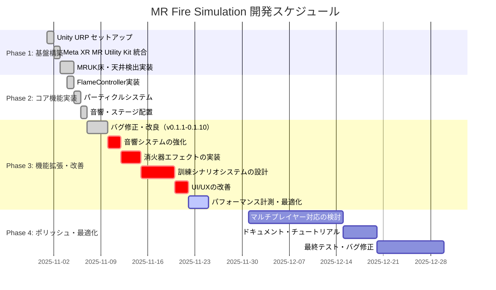

# プロジェクトステータス

最終更新: 2025-11-22

---

## プロジェクト概要

| 項目 | 内容 |
|------|------|
| プロジェクト名 | MR Fire Simulation |
| 会社名 | DefaultCompany |
| Unity バージョン | 6000.0.46f1 |
| テンプレート | Universal Render Pipeline (URP) - Empty Template |
| プロジェクトタイプ | Meta Quest MR (Mixed Reality) |
| 現在のバージョン | v0.1.10 |
| 開発段階 | Phase 3: 機能拡張・改善 |

---

## 📊 プロジェクト進捗レポート

**更新日時**: 2025-11-22
**現在のフェーズ**: Phase 3 - 機能拡張・改善
**全体進捗**: 72%

### 📈 進捗状況

- ✅ 完了済み: 20個
- 🚧 進行中: 0個
- ⏳ 未着手: 8個

### 🎯 今日のタスク（優先度順）

**本日 (2025-11-22) は「パフォーマンス計測・最適化」の開始予定日です**

#### 優先度 High タスク

1. **パフォーマンス計測・最適化** (High, 6h)
   - 開始予定: 2025-11-22 | 期限: 2025-11-25
   - **← 本日開始タスク**

2. **消火器エフェクトの実装** (High, 5h)
   - 開始予定: 2025-11-12 | 期限: 2025-11-15
   - **← 期限超過（要対応）**

3. **訓練シナリオシステムの設計** (High, 8h)
   - 開始予定: 2025-11-15 | 期限: 2025-11-20
   - **← 期限超過（要対応）**

#### 優先度 Medium タスク

4. **音響システムの強化** (Medium, 3h)
   - 開始予定: 2025-11-10 | 期限: 2025-11-12
   - **← 期限超過**

5. **UI/UXの改善** (Medium, 4h)
   - 開始予定: 2025-11-20 | 期限: 2025-11-22
   - **← 本日期限**

### ⚠️ 注意事項

#### 重要な問題点

**⚠️ スケジュール遅延が発生しています:**
- 11月10日以降、Phase 3の新規タスクが実施されていない
- 4つのタスクが期限超過または本日期限
- Phase 3残り工数: 26時間（11月30日まで残り8日）

#### リスク要因

1. **Phase 3の遅延リスク**
   - 未消化タスク: 26時間分
   - 残り期間: 8日間
   - 必要な作業ペース: 1日あたり3.25時間

2. **依存関係の問題**
   - task-008（最終テスト・バグ修正）は task-005, task-006 に依存
   - task-005が未着手のため、Phase 4開始にも影響

3. **Phase 4の圧縮リスク**
   - Phase 4残り工数: 24時間（12月1日～31日）
   - Phase 3の遅延がPhase 4に波及する可能性

#### 最近の成果

✅ **v0.1.6～v0.1.10で大幅な改善を達成** (2025-11-09～11-10)
- v0.1.10: FlameControllerに真上レイキャスト検出機能追加（任意のオブジェクト下に煙を配置）
- v0.1.9: FlameControllerにエディター用デバッグ機能追加（マウス入力、Gizmos可視化）
- v0.1.8: ステージ位置リセット機能追加（右コントローラーAボタン）
- v0.1.7: 移動・回転の挙動修正、ProjectOnFloor問題解決
- v0.1.6: VRデバッグシステム追加・床アンカー検出強化

#### 既知の問題

- なし

#### 推奨アクション

1. **スケジュールの見直し**
   - 遅延しているタスクの優先順位を再評価
   - Phase 3の終了日（11/30）を延長するか、タスクをPhase 4に移動

2. **優先タスクの実施**
   - 本日から「パフォーマンス計測・最適化」を開始
   - 「消火器エフェクト」「訓練シナリオ」の実施判断

3. **リソース配分の最適化**
   - 重要度の低いタスクの後回しまたは削減を検討
   - コア機能に集中

### 📅 開発スケジュール（Gantt Chart）



---

## 技術スタック

### レンダーパイプライン
- **Universal Render Pipeline (URP) v17.0.4**
  - PC 用設定: `Assets/Settings/PC_RPAsset.asset`
  - モバイル用設定: `Assets/Settings/Mobile_RPAsset.asset`
  - グローバル設定完備

### MR プラットフォーム
- **Meta XR SDK**
  - Meta XR MR Utility Kit (MRUK) - 空間認識、アンカー検出
  - OpenXR - クロスプラットフォームXRサポート
- **ターゲットデバイス**: Meta Quest 2/3/Pro

### 入力システム
- **OVR Input System**
- 対応デバイス:
  - Meta Quest Controllers (Touch Controllers)
  - Hand Tracking

---

## インストール済みパッケージ

### コア機能
- `com.unity.render-pipelines.universal` v17.0.4 - URP
- `com.unity.inputsystem` v1.14.0 - 新入力システム
- `com.unity.timeline` v1.8.7 - タイムライン
- `com.unity.visualscripting` v1.9.6 - ビジュアルスクリプティング
- `com.unity.ugui` v2.0.0 - UI システム

### MR/XR 機能
- `com.meta.xr.sdk.core` - Meta XR Core SDK
- `com.meta.xr.mrutilitykit` - MR Utility Kit

### AI/ナビゲーション
- `com.unity.ai.navigation` v2.0.6 - AI ナビゲーション

### ポストプロセス/VFX
- `com.unity.postprocessing` v3.4.0 - ポストプロセス

### 開発ツール
- `com.unity.test-framework` v1.5.1 - テストフレームワーク
- `com.unity.performance.profile-analyzer` v1.2.3 - パフォーマンス分析
- `com.unity.testtools.codecoverage` v1.2.6 - コードカバレッジ

### IDE 統合
- `com.unity.ide.rider` v3.0.35 - JetBrains Rider
- `com.unity.ide.visualstudio` v2.0.23 - Visual Studio

### カスタムパッケージ
- `com.coplaydev.unity-mcp` v7.0.0 - Unity MCP (Model Context Protocol)
  - GitHub: https://github.com/CoplayDev/unity-mcp.git

---

## MCP (Model Context Protocol) セットアップ状態

### 環境
- ✅ Python 3.13.9 - インストール済み
- ✅ uv 0.9.7 - インストール済み
- ✅ Claude CLI 2.0.34 - インストール済み

### MCP サーバー
- **状態**: ✅ 登録・起動済み
- **サーバー名**: unity-mcp
- **サーバーパス**: `Library\PackageCache\com.coplaydev.unity-mcp@5a06f89f6374\UnityMcpServer~\src\server.py`
- **プロトコル**: stdio
- **ポート**:
  - Unity Port: 動的
  - Server Port: 6500

### Unity Bridge
- **状態**: ✅ Connected (起動中)
- **接続テスト**: 実施済み

### Claude Code 連携
- **状態**: ✅ 登録済み
- **設定ファイル**: `C:\Users\USER\.claude.json`
- **起動コマンド**: `uv run --directory [server-path] server.py`

---

## プロジェクト構造

```
MR_sample_claude/
├── Assets/
│   ├── Scenes/
│   │   ├── SampleScene.unity          # メインシーン
│   │   ├── firescene.unity            # 火災シミュレーションシーン
│   │   └── FireDistinguish.unity      # 消火訓練シーン
│   ├── Script/                        # C# スクリプト
│   │   ├── FlameController.cs         # 炎の配置制御
│   │   ├── FlameAndSmokeManager.cs    # 炎と煙の統合管理
│   │   ├── FlameGrowthAndDamage.cs    # 炎の成長・ダメージ
│   │   ├── FlameAudio.cs              # 炎の音響効果
│   │   ├── ParticleController.cs      # パーティクル制御
│   │   ├── SmokeGrowth.cs             # 煙の成長
│   │   ├── SmokeColorFade.cs          # 煙の色フェード
│   │   ├── StageAlignMoveSave.cs      # ステージ配置システム
│   │   ├── flameHitPoint.cs           # 炎のヒットポイント
│   │   └── flame_manager.cs           # 炎の管理
│   ├── Prefab/                        # プレハブ
│   ├── Materials/                     # マテリアル
│   │   ├── shader/                    # カスタムシェーダー
│   │   │   └── DepthOccluder.shader  # 深度オクルーダー
│   │   ├── DepthOccluder.mat         # オクルーダーマテリアル
│   │   └── texture/                   # テクスチャ
│   ├── models/                        # 3Dモデル
│   ├── sound/                         # サウンドファイル
│   ├── Settings/                      # URP 設定
│   │   ├── PC_RPAsset.asset
│   │   ├── PC_Renderer.asset
│   │   ├── Mobile_RPAsset.asset
│   │   ├── Mobile_Renderer.asset
│   │   ├── DefaultVolumeProfile.asset
│   │   ├── SampleSceneProfile.asset
│   │   └── UniversalRenderPipelineGlobalSettings.asset
│   └── InputSystem_Actions.inputactions  # 入力システム定義
├── ProjectSettings/                   # Unity プロジェクト設定
├── Packages/                          # パッケージマニフェスト
│   └── manifest.json
├── .claude/                           # Claude Code ガイドライン
│   ├── CLAUDE.md
│   ├── PROJECT_STATUS.md              # このファイル
│   └── tasks.json                     # タスク管理
├── .vscode/                           # VS Code 設定
└── MR_sample_claude.sln               # Visual Studio ソリューション
```

---

## 主要スクリプト概要

### 火災シミュレーション

#### FlameController.cs (v0.1.9-0.1.10で改善)
- **役割**: コントローラーによる炎の配置とエディター上でのデバッグ
- **機能**:
  - **VR入力**: OVRInput による左コントローラートリガー検出
  - **エディター入力**: マウスクリックで炎を配置（デバッグ用）
  - **煙配置検出（優先順位）**:
    1. レイキャスト検出: 炎の真上にレイキャストして任意のオブジェクトに煙を配置
    2. MRUK天井アンカー: MRUKで検出した天井に配置
    3. フォールバック: 床面から3.5m上に配置
  - **Gizmos可視化**:
    - 炎から真上へのレイキャスト線（オレンジ）
    - レイキャストヒット位置（赤）
    - 天井平面、煙の配置予定位置（配置方法で色分け）
    - 炎から煙への線
  - **デバッグログ**: VRDebugPanelとUnityコンソールへの詳細ログ出力
  - 床へのレイキャスト
  - 炎プレハブのスポーン
  - 天井高さでの煙スポーン遅延

#### FlameAndSmokeManager.cs
- **役割**: MRUK統合、床/天井アンカー検出
- **機能**:
  - `MRUK.Instance.SceneLoadedEvent` リスナー
  - 床・天井アンカーの検出
  - `HasCeilingAnchor()` メソッドで天井Y座標提供

#### FlameGrowthAndDamage.cs
- **役割**: 炎の成長とダメージシミュレーション
- **機能**:
  - 時間経過による炎の拡大
  - ダメージ計算
  - 周辺オブジェクトへの影響

### パーティクル制御

#### ParticleController.cs
- **役割**: 汎用パーティクルシステム制御

#### SmokeGrowth.cs
- **役割**: 煙の成長シミュレーション
- **機能**: 時間経過による煙の拡散

#### SmokeColorFade.cs
- **役割**: 煙の色フェードエフェクト

### ステージ管理

#### StageAlignMoveSave.cs (v0.1.1-0.1.8で改善)
- **役割**: Quest3コントローラーでステージを移動/回転し、MRUK床アンカー基準で保存・復元
- **機能**:
  - **片手グリップ**: 平行移動（床面、X/Z方向自由）
  - **両手グリップ**: Y軸回転 - カメラ位置を中心に回転（v0.1.5）
  - **右Aボタン**: 初期位置にリセット（v0.1.8）
  - **床面ロック**: Y座標のみを床の高さに固定（v0.1.7で修正）
  - **レイキャスト**: ステージ自身を除外して床検出
  - **可視性制御**: グリップ中のみステージを表示（v0.1.3）
  - **保存/復元**: PlayerPrefs(JSON)に相対姿勢で保持
  - **v0.1.7修正**: ProjectOnFloorの誤用を修正、Raycastの結果を直接使用

### 音響

#### FlameAudio.cs
- **役割**: 炎の音響効果
- **機能**: 炎の状態に応じた音響再生

### ビジュアル

#### SimpleWireframe.shader (v0.1.4-0.1.5で改良)
- **役割**: メッシュのワイヤーフレーム表示（Quest3最適化済み）
- **機能**:
  - **Vertex Color方式**: Geometry Shader不使用でモバイルGPUに最適化（v0.1.5）
  - **バリセントリック座標**: Vertex Colorから取得（WireframeMeshProcessorで前処理）
  - **発光エッジ**: インスペクタで調整可能な発光効果
  - **パラメータ**:
    - Wire Color: 線の色
    - Wire Thickness: 線の太さ（0.0001〜0.05）
    - Emission Strength: 発光強度（0〜10）
    - Fill Color: ポリゴン内部の塗りつぶし色

#### WireframeMeshProcessor.cs (v0.1.5で追加)
- **役割**: メッシュのVertex Colorにバリセントリック座標を設定
- **機能**:
  - メッシュ前処理でバリセントリック座標をベイク
  - カスタムエディターで「メッシュを処理」ボタン提供
  - 実行時またはEditor上で処理可能

### デバッグ

#### VRDebugPanel.cs (v0.1.6で追加)
- **役割**: VR空間内にデバッグ情報を表示
- **機能**:
  - TextMeshPro / legacy Text 両対応
  - カラーコード付きログ（Info/Warning/Error/Success）
  - タイムスタンプ表示
  - カメラ追従モード（オプション）
  - 最大ログ行数設定可能
  - Quest3でのリアルタイムデバッグに使用

---

## 進捗管理

### ✅ 完了したタスク (Phase 1-2)

#### Phase 1: 基盤構築
- [x] Unity 6000.0.46f1 + URP セットアップ
- [x] Meta XR MR Utility Kit 統合
- [x] MRUK床・天井検出実装
- [x] MCP 環境セットアップ（Python, uv, Claude CLI）
- [x] Unity MCP サーバーの Claude Code への登録
- [x] Unity Bridge の起動確認

#### Phase 2: コア機能実装
- [x] FlameController - コントローラーによる炎配置
- [x] FlameAndSmokeManager - 炎と煙の統合管理
- [x] パーティクルシステム（炎・煙）実装
- [x] FlameGrowthAndDamage - 炎の成長とダメージ
- [x] SmokeGrowth/SmokeColorFade - 煙のシミュレーション
- [x] FlameAudio - 炎の音響効果
- [x] StageAlignMoveSave - ステージ配置システム

#### Phase 3: 最近の改善
- [x] **v0.1.1**: ステージ回転位置リセット修正
- [x] **v0.1.2**: ステージ回転時レイキャスト干渉修正
- [x] **v0.1.3**: ステージ可視性制御・ワイヤーフレームマテリアル
- [x] **v0.1.4**: ワイヤーフレームシェーダー改良（Geometry Shader、発光エッジ）
- [x] **v0.1.5**: Quest3向けワイヤーフレーム最適化・回転中心改善
- [x] **v0.1.6**: VRデバッグシステム追加・床アンカー検出強化
- [x] **v0.1.7**: 移動・回転の挙動修正、ProjectOnFloor問題解決
- [x] **v0.1.8**: ステージ位置リセット機能追加
- [x] **v0.1.9**: FlameControllerエディターデバッグ機能（マウス入力、Gizmos可視化、ログ強化）
- [x] **v0.1.10**: FlameController真上レイキャスト検出（任意のオブジェクト下に煙配置、優先順位ロジック）

### 🚧 現在のタスク (Phase 3)

- [ ] 音響システムの強化（環境音、警告音）
- [ ] 消火器エフェクトの実装
- [ ] 訓練シナリオシステムの設計
- [ ] UI/UXの改善（メニュー、HUD）
- [ ] パフォーマンス計測・最適化

### ⏳ 今後のタスク (Phase 4)

- [ ] マルチプレイヤー対応の検討
- [ ] ドキュメント・チュートリアル作成
- [ ] 最終テスト・バグ修正

---

## 開発方針

このプロジェクトは **Specification-Driven Development（仕様駆動開発）** を採用しています。

### 開発ワークフロー（5段階）

1. **Stage 1: Requirements** - 要件定義
   - コマンド: `/requirements`
   - 出力: `.tmp/requirements.md`

2. **Stage 2: Design** - 設計
   - コマンド: `/design`
   - 出力: `.tmp/design.md`

3. **Stage 3: Test Design** - テスト設計
   - コマンド: `/test-design`
   - 出力: `.tmp/test_design.md`

4. **Stage 4: Task List** - タスク分解
   - コマンド: `/tasks`
   - 出力: `.tmp/tasks.md`

5. **Stage 5: Implementation** - 実装
   - TodoWrite ツールでタスク管理
   - 各タスク完了時: lint & typecheck 実行

詳細は `.claude/CLAUDE.md` を参照。

---

## 📊 フェーズ別進捗

| フェーズ | 状態 | 進捗 | 期間 | 備考 |
|---------|------|------|------|------|
| Phase 1: 基盤構築 | ✅ 完了 | 100% | 2025-11-01～11-05 | Unity/MRUK セットアップ完了 |
| Phase 2: コア機能実装 | ✅ 完了 | 100% | 2025-11-05～11-07 | 炎・煙シミュレーション実装完了 |
| Phase 3: 機能拡張・改善 | 🚧 進行中 | 35% | 2025-11-07～11-30 | **⚠️ スケジュール遅延中** |
| Phase 4: ポリッシュ・最適化 | ⏳ 未着手 | 0% | 2025-12-01～12-31 | Phase 3の遅延により影響の可能性 |

---

## メトリクス

| 指標 | 値 |
|------|-----|
| 総予定工数 | 120時間 |
| 実績工数 | 63.5時間 |
| 完了タスク数 | 20個 |
| 未完了タスク数 | 8個 |
| 全体進捗率 | 72% |
| 現在のフェーズ進捗 | 35% (Phase 3) |
| Phase 3残り工数 | 26時間 |
| Phase 3残り日数 | 8日（11月30日まで） |
| 必要な作業ペース | 3.25時間/日 |

---

## プロジェクト設定

### 画面解像度
- **デフォルト解像度**: 1024 x 768
- **Web 解像度**: 960 x 600
- **Android デフォルト**: 1920 x 1080
- **リサイズ可能ウィンドウ**: 無効

### カラースペース
- **アクティブカラースペース**: Linear (m_ActiveColorSpace: 1)

### グラフィックス
- **GPU Skinning**: 有効
- **MT Rendering**: 有効

### ビルドターゲット
- **Primary**: Android (Meta Quest)
- **Secondary**: PC (Windows/Mac/Linux) - デバッグ用

---

## 注意事項

### コーディング規則
- Unity の `[SerializeField]` でインスペクター公開
- Unity のコルーチンで遅延操作（例: `SpawnSmokeAfterDelay`）
- `Instantiate`/`Destroy` 前の null チェック
- レイキャストでレイヤーマスク使用（例: `floorLayer`）

### MR Utility Kit 使用時の注意
- `MRUK.Instance.SceneLoadedEvent` を待ってからアンカーアクセス
- アンカーラベルはビットフラグチェック: `(anchor.Label & MRUKAnchor.SceneLabels.FLOOR) != 0`
- アンカー未検出時のフォールバック実装

### MCP 使用時の注意
- **新しいセッション開始時**: MCP ツールは会話開始時にロードされるため、セットアップ後は新しい会話を開始すること
- **Unity エディタ**: MCP 使用時は Unity エディタを起動し、Unity Bridge が Connected 状態であることを確認

### ドキュメント管理
- 設計メモ: `.tmp/` フォルダに保存
- プロジェクト進捗: このファイル（`PROJECT_STATUS.md`）を更新
- ガイドライン: `.claude/CLAUDE.md` に記載

---

## 参考リンク

- [Unity MCP GitHub](https://github.com/CoplayDev/unity-mcp)
- [Unity MCP Discord](https://discord.gg/y4p8KfzrN4)
- [MCP Documentation](https://github.com/CoplayDev/unity-mcp/wiki)
- [Meta XR SDK Documentation](https://developer.oculus.com/documentation/)

---

## 更新履歴

| 日付 | 内容 |
|------|------|
| 2025-11-01 | プロジェクト初期セットアップ |
| 2025-11-02 | Meta XR MR Utility Kit 統合 |
| 2025-11-03 | MRUK床・天井検出実装 |
| 2025-11-04 | 炎配置・管理システム実装 |
| 2025-11-05 | パーティクルシステム、炎の成長実装 |
| 2025-11-06 | 煙のシミュレーション、音響効果実装 |
| 2025-11-07 | ステージ配置システム実装、v0.1.1リリース |
| 2025-11-08 | v0.1.2リリース（レイキャスト干渉修正） |
| 2025-11-09 | v0.1.3リリース（可視性制御、ワイヤーフレーム）、プロジェクト進捗管理整備 |
| 2025-11-09 | v0.1.4リリース（ワイヤーフレームシェーダー改良：Geometry Shader、発光エッジ） |
| 2025-11-09 | v0.1.5リリース（Quest3向けワイヤーフレーム最適化、回転中心改善） |
| 2025-11-09 | v0.1.6リリース（VRデバッグシステム、床アンカー検出強化）※移動・回転に問題あり |
| 2025-11-09 | v0.1.7リリース（移動・回転の挙動修正、ProjectOnFloor問題解決）✅全機能正常動作 |
| 2025-11-09 | v0.1.8リリース（ステージ位置リセット機能：右Aボタン） |
| 2025-11-10 | v0.1.9リリース（FlameControllerエディターデバッグ機能追加） |
| 2025-11-10 | v0.1.10リリース（FlameController真上レイキャスト検出機能追加） |
| 2025-11-22 | プロジェクト進捗レポート更新（Phase 3スケジュール遅延を確認） |
