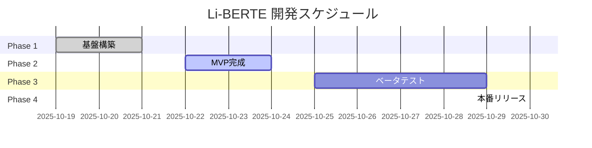

## 顧客向け進捗レポート生成

あなたはプロジェクトマネージャーとして、クライアント向けの分かりやすい進捗レポートを生成します。

### タスク

1. **`.claude/tasks.json` を読み込む**

2. **顧客向けレポートを生成**

   以下の内容を含む、分かりやすいレポートを作成：

   - プロジェクト概要
   - 現在のフェーズと進捗率
   - 今週の成果（完了したタスク）
   - 次週の予定（予定されているタスク）
   - スケジュール遵守状況
   - リスク・課題
   - Mermaid Gantt Chart（視覚的に進捗を表示）

3. **reports/ ディレクトリに保存**

   ファイル名: `reports/progress_report_YYYY-MM-DD.md`

### レポートフォーマット

```markdown
# Li-BERTE プロジェクト進捗レポート

**報告日**: [YYYY-MM-DD]
**報告者**: 開発チーム

---

## 📋 プロジェクト概要

**プロジェクト名**: Li-BERTE（リベルテ）
**サービス概要**: 健康志向・高級志向のマッチングアプリ
**目標リリース日**: 2025-10-30

---

## 📊 進捗サマリー

| 項目 | 状況 |
|------|------|
| 全体進捗 | ██████████░░░░░░░░░░ 50% |
| 現在のフェーズ | Phase 2: MVP完成 |
| 完了タスク | 10 / 22 |
| 予定との差異 | ±0日（予定通り） |

---

## ✅ 今週の成果

- [タスク1の完了内容]
- [タスク2の完了内容]
- [タスク3の完了内容]

**ハイライト**:
- [特筆すべき成果]

---

## 📅 次週の予定

- [ ] [タスク1]
- [ ] [タスク2]
- [ ] [タスク3]

**重点項目**:
- [優先度の高いタスク]

---

## 📈 スケジュール（Gantt Chart）



---

## ⚠️ リスク・課題

| リスク項目 | 影響度 | 対策 |
|-----------|--------|------|
| [リスク1] | 高/中/低 | [対策内容] |

---

## 💰 コスト状況

| 項目 | 予算 | 実績 | 差異 |
|------|------|------|------|
| 開発工数 | XXh | XXh | ±Xh |

---

## 📸 スクリーンショット

[主要画面のスクリーンショット or プレビューURL]

---

## 📞 お問い合わせ

ご質問・ご要望がございましたら、お気軽にお知らせください。

---

**次回報告予定**: [次の金曜日の日付]
```

### 出力

レポート生成後、以下を実行：

1. ファイルを保存
2. レポートのパスを表示
3. 主要な進捗指標をサマリー表示

**IMPORTANT**:
- 顧客が理解しやすい言葉を使用
- 技術的な詳細は最小限に
- 視覚的な要素（チャート、表）を活用
- 日本語で出力
