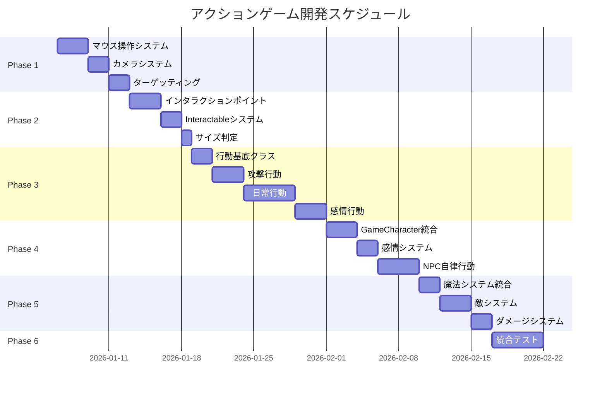

# アクションゲーム開発ロードマップ

## プロジェクト概要

**目的**: VRMキャラクターを活用し、プレイヤーとNPCが相互にインタラクションするリアリティの高いアクションゲームを開発

**既存資産**:
- VRMExpressionController（表情制御 + プリセット）
- VRMAnimationController（アニメーション制御）
- CharacterNavigator（NavMesh移動）
- VRMFinalIKController（IK制御）
- VRMEyeGazeController（視線制御）
- RFX4_EffectEvent（エフェクト）
- PlayerController / PlayerAttack（既存）
- MagicaCloth2（布物理）

---

## 開発フェーズ概要

```
Phase 1: 基盤システム（操作・移動・カメラ）
    ↓
Phase 2: インタラクションシステム（ポイント・タグ・行動判定）
    ↓
Phase 3: 行動システム（各アクション実装）
    ↓
Phase 4: キャラクターシステム（Player/NPC統合）
    ↓
Phase 5: 戦闘システム（攻撃・魔法・敵）
    ↓
Phase 6: 統合テスト・調整
```

---

## Phase 1: 基盤システム

### 1.1 マウス操作システム
**ファイル**: `Assets/Scripts/Input/MouseInputController.cs`

| 機能 | 説明 |
|------|------|
| 右クリック移動 | クリック位置へNavMesh移動 |
| 左クリックアクション | ターゲットに応じた行動実行 |
| ホバー検出 | マウス下のオブジェクト判定 |
| カーソル変更 | 状況に応じたカーソル表示 |

**依存**: CharacterNavigator, Raycast

### 1.2 カメラシステム
**ファイル**: `Assets/Scripts/Camera/OrbitCamera.cs`

| 機能 | 説明 |
|------|------|
| オービット回転 | 対象を中心に回転 |
| ズーム | スクロールでズーム |
| フォーカス切替 | 指定オブジェクトにフォーカス |
| 障害物回避 | 壁を避けて位置調整 |

**依存**: Cinemachine（推奨）

### 1.3 ターゲッティングシステム
**ファイル**: `Assets/Scripts/Targeting/TargetingSystem.cs`

| 機能 | 説明 |
|------|------|
| タグ判定 | Enemy, Object, Player, Chara |
| 属性判定 | grabbable, eatable, sittable等 |
| 距離判定 | 近接/遠距離の自動判定 |
| UI表示 | ターゲットハイライト |

---

## Phase 2: インタラクションシステム

### 2.1 インタラクションポイントシステム
**ファイル**: `Assets/Scripts/Interaction/InteractionPoint.cs`

```
キャラクターのポイント:
├── eye_point     - 視線ターゲット（LookAt用）
├── mouth_point   - 口元（eat, kiss用）
├── shoulder_point - 肩（hug用）
├── hip_point     - 腰（hug用）
├── hand_point    - 手（grab用）
└── foot_point    - 足（stomp用）

オブジェクトのポイント:
├── grab_point    - 掴む位置
├── sit_point     - 座る位置
├── touch_point   - 触る位置
└── stomp_point   - 踏む位置

Enemyのポイント:
├── target_point  - 攻撃目標
├── grab_point    - 引きずり用
└── weak_point    - 弱点
```

### 2.2 インタラクタブルオブジェクト
**ファイル**: `Assets/Scripts/Interaction/Interactable.cs`

| 属性 | 対応アクション |
|------|---------------|
| grabbable | grab（持つ/置く） |
| eatable | eat（食べる） |
| sittable | sit（座る） |
| touchable | touch（触る） |
| stompable | stomp（踏む） |
| talkable | talk（会話） |

### 2.3 サイズ判定システム
**ファイル**: `Assets/Scripts/Interaction/SizeCategory.cs`

| サイズ | 判定 | 挙動変化 |
|--------|------|---------|
| Tiny | < 0.1m | 片手で摘む |
| Small | 0.1-0.3m | 片手で持つ |
| Medium | 0.3-0.8m | 両手で持つ |
| Large | > 0.8m | 顔を近づける/押す |

---

## Phase 3: 行動システム

### 3.1 行動基底クラス
**ファイル**: `Assets/Scripts/Actions/ActionBase.cs`

```csharp
public abstract class ActionBase
{
    public abstract string ActionName { get; }
    public abstract bool CanExecute(ActionContext context);
    public abstract IEnumerator Execute(ActionContext context);
    public virtual void OnStart() { }
    public virtual void OnEnd() { }
}
```

### 3.2 攻撃行動
| アクション | トリガー | IK/アニメ | 表情 |
|-----------|---------|-----------|------|
| Attack（近接） | 左クリック + 近距離 | Hand IK → 武器振り | angry/neutral |
| Magic（遠距離） | 左クリック + 遠距離 | Hand IK → 詠唱 | happy/angry |

### 3.3 日常行動
| アクション | トリガー | IK/アニメ | 表情 |
|-----------|---------|-----------|------|
| Grab | 左クリック + grabbable | Hand IK → 掴み | neutral |
| Touch | 左クリック + touchable | Hand IK → 触る | neutral |
| Eat | 左クリック + eatable（所持時） | Hand→mouth IK | happy |
| Sit | 左クリック + sittable | Hip IK → 座る | relaxed |
| Stomp | 左クリック + stompable | Foot IK → 踏む | neutral |

### 3.4 感情行動
| アクション | トリガー | IK/アニメ | 表情 |
|-----------|---------|-----------|------|
| Talk | 左クリック + talkable | LookAt IK + 口パク | 感情依存 |
| Kiss | 特殊コマンド | LookAt + Head IK | embarrassed |
| Hug | 特殊コマンド | Both Arms IK | happy/sad |

### 3.5 移動行動
| アクション | トリガー | アニメ | 速度 |
|-----------|---------|--------|------|
| Walk | 右クリック | 歩行 | 通常 |
| Run | 右クリック（長距離） | 走行 | 高速 |
| Fly | 特殊状態 | 浮遊 | 最速 |

---

## Phase 4: キャラクターシステム

### 4.1 統合キャラクターPrefab
**ファイル**: `Assets/Scripts/Character/GameCharacter.cs`

```
GameCharacter
├── [Header: 基本設定]
│   ├── CharacterType: Player / NPC
│   ├── CharacterName
│   └── VRM Model Reference
│
├── [Header: ステータス]
│   ├── HP (現在/最大)
│   ├── Emotion (感情状態)
│   └── State (通常/戦闘/会話等)
│
├── [Header: コントローラー]
│   ├── VRMExpressionController
│   ├── VRMAnimationController
│   ├── VRMFinalIKController
│   ├── VRMEyeGazeController
│   └── CharacterNavigator
│
├── [Header: インタラクション]
│   ├── InteractionPoints[]
│   └── CurrentHeldObject
│
└── [Header: AI（NPCのみ）]
    └── NPCBehaviorController
```

### 4.2 感情システム
**ファイル**: `Assets/Scripts/Character/EmotionSystem.cs`

| 感情 | 表情プリセット | トリガー例 |
|------|---------------|-----------|
| Joy | happy, laugh | 成功、勝利 |
| Anger | angry, furious | 攻撃受け、失敗 |
| Sadness | sad, crying | ダメージ、敗北 |
| Fear | shocked, confused | 強敵、危険 |
| Neutral | neutral | 通常時 |

### 4.3 HP連動表情
```
HP 100-70%: 通常表情
HP 70-40%:  やや辛そう（sad:0.2）
HP 40-20%:  苦しそう（sad:0.4 + angry:0.2）
HP 20-0%:   瀕死（sad:0.6 + blink:0.3）
```

### 4.4 NPC自律行動
**ファイル**: `Assets/Scripts/AI/NPCBehaviorController.cs`

| 状態 | 行動 |
|------|------|
| Idle | 周囲を見回す、座る |
| Patrol | 指定ルート巡回 |
| Follow | プレイヤー追従 |
| Combat | 敵と戦闘 |
| Interact | オブジェクト操作 |

---

## Phase 5: 戦闘システム

### 5.1 魔法システム
**ファイル**: `Assets/Scripts/Combat/MagicSystem.cs`

| 要素 | 実装 |
|------|------|
| エフェクト | RFX4_EffectEvent |
| ターゲット | マウス位置/enemy_point |
| ダメージ | Collider判定 |
| 属性 | 炎/氷/雷など |

### 5.2 敵システム
**ファイル**: `Assets/Scripts/Enemy/EnemyController.cs`

| 機能 | 説明 |
|------|------|
| HP管理 | ダメージ計算、死亡判定 |
| 物理有効化 | HP低下で物理ON |
| ラグドール | 死亡時Ragdoll化 |
| エフェクト | ダメージ/死亡エフェクト |
| 引きずり | grab_pointでドラッグ可能 |

### 5.3 ダメージシステム
**ファイル**: `Assets/Scripts/Combat/DamageSystem.cs`

```
ダメージ発生
    ↓
HP減少
    ↓
├─ HP > 0: ヒットリアクション + 表情変化
│
└─ HP <= 0:
    ├─ Rigidbody有効化
    ├─ ラグドール化
    ├─ 死亡エフェクト
    └─ grab_point有効化（引きずり可能に）
```

---

## Phase 6: 統合テスト

### テストシナリオ一覧

| # | シナリオ | 確認機能 |
|---|---------|---------|
| 1 | 移動して物を拾う/置く | 移動, grab, IK |
| 2 | 物を触りながら話す | touch, talk, 口パク, 表情 |
| 3 | 魔法で敵を倒し引きずる | magic, enemy, ragdoll, grab |
| 4 | 座って食事する | sit, grab, eat, 表情 |
| 5 | NPCと会話 | talk, LookAt, 表情遷移 |
| 6 | 複合行動テスト | 全機能統合 |

---

## 開発スケジュール（目安）



---

## ファイル構成（予定）

```
Assets/Scripts/
├── Input/
│   └── MouseInputController.cs
├── Camera/
│   └── OrbitCamera.cs
├── Targeting/
│   └── TargetingSystem.cs
├── Interaction/
│   ├── InteractionPoint.cs
│   ├── Interactable.cs
│   └── SizeCategory.cs
├── Actions/
│   ├── ActionBase.cs
│   ├── ActionContext.cs
│   ├── Combat/
│   │   ├── AttackAction.cs
│   │   └── MagicAction.cs
│   ├── Daily/
│   │   ├── GrabAction.cs
│   │   ├── TouchAction.cs
│   │   ├── EatAction.cs
│   │   ├── SitAction.cs
│   │   └── StompAction.cs
│   └── Emotion/
│       ├── TalkAction.cs
│       ├── KissAction.cs
│       └── HugAction.cs
├── Character/
│   ├── GameCharacter.cs
│   └── EmotionSystem.cs
├── AI/
│   └── NPCBehaviorController.cs
├── Combat/
│   ├── MagicSystem.cs
│   └── DamageSystem.cs
└── Enemy/
    └── EnemyController.cs
```

---

**作成日**: 2026-01-05
**バージョン**: 1.0
