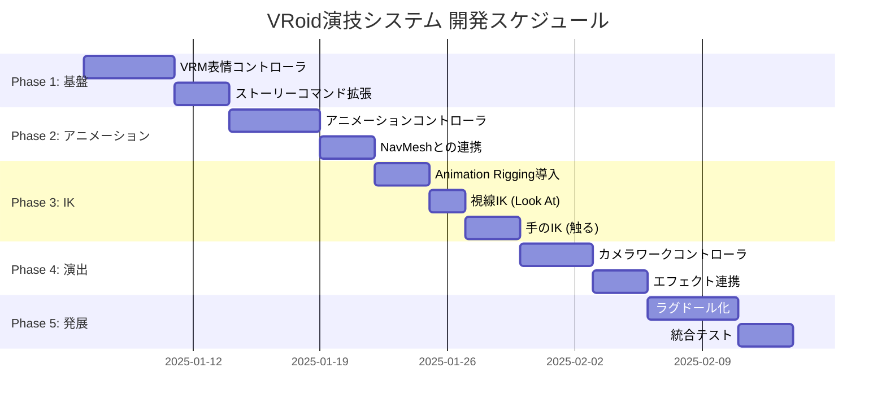

# VRoidキャラクター演技システム 開発ロードマップ

**作成日**: 2025-12-30
**プロジェクト**: RPG_defete
**バージョン**: v1.0

---

## 1. 概要

### 1.1 目的

VRoidキャラクターをストーリーエンジンと連携させ、表情・アニメーション・IK・カメラワーク・エフェクトを統合的に制御する「演技システム」を構築する。

### 1.2 主要機能

| 機能 | 説明 |
|------|------|
| VRM表情コントローラ | 表情の制御・ブレンド・遷移 |
| アニメーションコントローラ | ポーズ・モーション再生、NavMesh連携 |
| IKシステム | 視線制御（Look At）、手の制御（触る） |
| カメラワーク | フォーカス、ズーム、シェイク |
| エフェクト連携 | パーティクル、演出効果 |
| ラグドール | やられ時のだらん演出 |

---

## 2. 既存基盤

### 2.1 プロジェクト内の資産

| 要素 | 状況 | ファイル |
|------|------|----------|
| ストーリーエンジン | 実装済み | `Assets/Scripts/Story/` |
| VRM表情フィールド | 設計済み | `SkillData.cs` (95-104行) |
| UniVRM | 導入済み | `Packages/com.vrmc.vrm/` |
| CombatSystem | 実装済み | `Assets/Scripts/Combat/` |

### 2.2 SkillData.cs の既存VRM表情設計

```csharp
[Header("表情 (VRM BlendShape)")]
[Tooltip("VRM表情名 (Angry, Fun, Surprised等)")]
public string expressionName = "Neutral";

[Tooltip("表情の強さ (0-1)")]
[Range(0f, 1f)]
public float expressionWeight = 1f;

[Tooltip("表情の持続時間")]
public float expressionDuration = 0.5f;
```

---

## 3. 開発フェーズ

### Phase 1: 基盤システム

**VRM表情コントローラ**

- 新規作成: `Assets/Scripts/Character/VRMExpressionController.cs`
- VRM10標準表情の制御 (Happy, Angry, Sad, Surprised, Relaxed, Neutral)
- カスタム表情のサポート
- 表情ブレンド・遷移機能
- ストーリーエンジンからの呼び出しAPI

**ストーリーコマンド拡張**

| コマンド | 説明 |
|----------|------|
| `expression` | 表情変更 |
| `pose` | ポーズ/アニメーション再生 |
| `move` | キャラクター移動 |
| `lookat` | 視線制御 |
| `touch` | 手で触る動作 |
| `camera` | カメラワーク |
| `effect` | エフェクト発生 |

---

### Phase 2: アニメーションシステム

**VRMアニメーションコントローラ**

- 新規作成: `Assets/Scripts/Character/VRMAnimationController.cs`
- Animator Controllerの動的制御
- AnimationClip再生
- ブレンドツリー対応

**アニメーション取得方法**

| ソース | 特徴 |
|--------|------|
| Mixamo | 無料Humanoidアニメーション |
| Unity Asset Store | 有料/無料パック |
| BOOTH/VRoid Hub | VRM/VRMA形式 |
| MMD→VRM変換 | Blender経由 |

**NavMesh連携**

- 新規作成: `Assets/Scripts/Character/CharacterNavigator.cs`
- NavMeshAgentベースの移動
- パス追従アニメーション
- 目的地到達イベント

---

### Phase 3: IKシステム

**必要パッケージ**

```
com.unity.animation.rigging
```

**視線IK (Look At)**

- 使用コンポーネント: Multi-Aim Constraint
- 頭と目の回転制御
- ターゲットへの追従

```csharp
// ランタイム制御例
multiAimConstraint.data.sourceObjects.Clear();
multiAimConstraint.data.sourceObjects.Add(new WeightedTransform(target, 1f));
rigBuilder.Build();
```

**手のIK（特定箇所を触る）**

- 使用コンポーネント: Two Bone IK Constraint
- 肩→肘→手のIKチェーン
- ターゲット位置の動的変更
- Hint（肘の向き）制御

---

### Phase 4: 演出システム

**カメラワークコントローラ**

- 新規作成: `Assets/Scripts/Camera/StoryCameraController.cs`
- キャラクターフォーカス
- カメラ位置・回転のアニメーション
- ズームイン/アウト
- シェイク効果

**エフェクト連携**

- 既存の `SkillData.effectPrefab` を活用
- パーティクル生成
- 位置・タイミング制御

---

### Phase 5: ラグドール

**実装アプローチ比較**

| 方式 | 特徴 | コスト | 推奨度 |
|------|------|--------|--------|
| Unity Ragdoll Wizard | 標準機能、基本的 | 無料 | ⭐⭐⭐ |
| Active Ragdoll | 部分制御可能 | 無料 | ⭐⭐⭐⭐ |
| Puppet Master | 高品質、多機能 | 有料 | ⭐⭐⭐⭐⭐ |

**VRMへの適用手順**

1. Humanoidボーンマッピングを利用
2. 各ボーンにCollider + Rigidbody追加
3. CharacterJointで接続
4. Animator無効化→ラグドール有効化で遷移

```csharp
// アニメーション→ラグドール遷移
animator.enabled = false;
foreach (var rb in ragdollRigidbodies)
{
    rb.isKinematic = false;
}
```

---

## 4. ファイル構成

```
Assets/Scripts/
├── Character/
│   ├── VRMExpressionController.cs    # 表情制御
│   ├── VRMAnimationController.cs     # アニメーション制御
│   ├── CharacterNavigator.cs         # 移動・ナビゲーション
│   ├── CharacterIKController.cs      # IK制御
│   └── RagdollController.cs          # ラグドール制御
├── Camera/
│   └── StoryCameraController.cs      # カメラワーク
├── Story/
│   └── Commands/
│       ├── ExpressionCommand.cs      # 表情コマンド
│       ├── PoseCommand.cs            # ポーズコマンド
│       ├── MoveCommand.cs            # 移動コマンド
│       ├── LookAtCommand.cs          # 視線コマンド
│       ├── CameraCommand.cs          # カメラコマンド
│       └── EffectCommand.cs          # エフェクトコマンド
```

---

## 5. 開発スケジュール



---

## 6. 優先度

### 🔴 High Priority（最優先）

1. **VRMExpressionController** - 表情制御は全ての演技の基本
2. **ストーリーコマンド拡張** - ストーリーエンジンとの連携
3. **Animation Rigging導入** - IKの前提条件

### 🟡 Medium Priority

4. **VRMAnimationController** - アニメーション再生
5. **視線IK** - 最も効果的な演技要素
6. **カメラワーク** - 演出効果

### 🟢 Lower Priority

7. **手のIK** - 実装が複雑
8. **ラグドール** - 特定シーン限定

---

## 7. 技術要件

### 必要パッケージ

| パッケージ | 用途 | 状態 |
|-----------|------|------|
| UniVRM (com.vrmc.vrm) | VRM読み込み・表情制御 | 導入済み |
| Animation Rigging | IK制御 | 要導入 |
| AI Navigation | NavMesh | 導入済み |

### 参考リソース

- [UniVRM Documentation](https://vrm.dev/)
- [Unity Animation Rigging](https://docs.unity3d.com/Packages/com.unity.animation.rigging@latest)
- [Mixamo](https://www.mixamo.com/) - 無料アニメーション

---

## 8. 調査結果詳細

### VRoid標準モーション・表情について

**結論**: VRoid Studio内蔵のポーズ・モーションは**直接エクスポート不可**

**代替手段**:
- VRM形式でエクスポートすれば**BlendShape（表情）は保持**される
- 表情は UniVRM の `Vrm10Instance.Runtime.Expression` で制御可能
- アニメーションは Mixamo / Asset Store / BOOTH から取得

### Unity IK (Animation Rigging)

- **Multi-Aim Constraint**: 視線制御に最適
- **Two Bone IK Constraint**: 手のIKに使用
- ランタイムでの動的ターゲット変更が可能

### ラグドール

- Unity Ragdoll Wizard で基本実装可能
- VRMのHumanoidリグを活用
- Active Ragdollで部分的制御も可能

---

## 更新履歴

| 日付 | 内容 |
|------|------|
| 2025-12-30 | 初版作成 |
