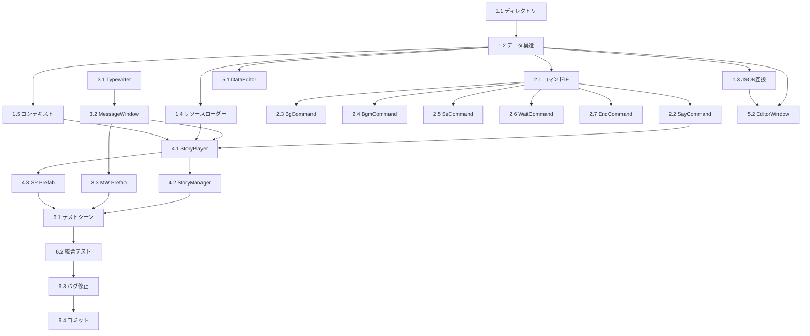

# タスクリスト: ストーリー・メッセージウィンドウシステム

## 概要

| 項目 | 値 |
|------|-----|
| 総タスク数 | 24 |
| 推定合計時間 | 16-20時間 |
| フェーズ数 | 5 |

---

## Phase 1: 基盤構築 (3-4時間)

### Task 1.1: ディレクトリ構造作成
**推定: 15分**

- [ ] `Assets/Scripts/Story/Core/` 作成
- [ ] `Assets/Scripts/Story/Commands/` 作成
- [ ] `Assets/Scripts/Story/UI/` 作成
- [ ] `Assets/Scripts/Story/Editor/` 作成
- [ ] `Assets/Resources/Story/Portraits/` 作成
- [ ] `Assets/Resources/Story/Backgrounds/` 作成
- [ ] `Assets/Resources/Story/BGM/` 作成
- [ ] `Assets/Resources/Story/SE/` 作成
- [ ] `Assets/Prefabs/Story/` 作成

### Task 1.2: データ構造実装
**推定: 45分**

- [ ] `StoryCommandData.cs` 作成
  - PortraitPosition enum
  - 全コマンドパラメータフィールド
  - Serializable属性
- [ ] `StoryData.cs` 作成
  - ScriptableObject継承
  - storyId, commands フィールド
  - CreateAssetMenu属性

### Task 1.3: JSON互換実装
**推定: 1時間**

- [ ] `StoryJsonData.cs` (JSON用中間クラス)
- [ ] `StoryData.ImportFromJson()` 実装
- [ ] `StoryData.ExportToJson()` 実装
- [ ] ユニットテスト: JSON往復テスト

### Task 1.4: リソースローダー実装
**推定: 30分**

- [ ] `StoryResourceLoader.cs` 作成
  - LoadPortrait()
  - LoadBackground()
  - LoadBgm()
  - LoadSe()
  - PreloadStory()

### Task 1.5: コンテキスト実装
**推定: 30分**

- [ ] `StoryContext.cs` 作成
  - UI参照
  - AudioSource参照
  - リソース辞書

---

## Phase 2: コマンドシステム (2-3時間)

### Task 2.1: コマンドインターフェース
**推定: 15分**

- [ ] `IStoryCommand.cs` 作成
  - Execute(context, data) メソッド定義

### Task 2.2: SayCommand実装
**推定: 30分**

- [ ] `SayCommand.cs` 作成
  - MessageWindow.ShowDialogue()呼出
  - 立ち絵設定
  - セリフ表示待機

### Task 2.3: BgCommand実装
**推定: 30分**

- [ ] `BgCommand.cs` 作成
  - 背景画像設定
  - フェード処理（Coroutine）

### Task 2.4: BgmCommand実装
**推定: 45分**

- [ ] `BgmPlayCommand.cs` 作成
  - AudioSource設定
  - ループ/音量設定
  - フェードイン処理
- [ ] `BgmStopCommand.cs` 作成
  - フェードアウト処理
  - Stop()呼出

### Task 2.5: SeCommand実装
**推定: 15分**

- [ ] `SeCommand.cs` 作成
  - PlayOneShot()呼出
  - 音量設定

### Task 2.6: WaitCommand実装
**推定: 10分**

- [ ] `WaitCommand.cs` 作成
  - WaitForSeconds使用

### Task 2.7: EndCommand実装
**推定: 10分**

- [ ] `EndCommand.cs` 作成
  - MessageWindow.Hide()呼出
  - returnTo情報設定

---

## Phase 3: UI実装 (3-4時間)

### Task 3.1: TypewriterEffect実装
**推定: 1時間**

- [ ] `TypewriterEffect.cs` 作成
  - StartTyping() Coroutine
  - Skip() メソッド
  - OnTypingCompleted イベント
  - charactersPerSecond設定
- [ ] 統合テスト: タイプライター動作確認

### Task 3.2: MessageWindow実装
**推定: 1.5時間**

- [ ] `MessageWindow.cs` 作成
  - Show()/Hide() + フェード
  - ShowDialogue() Coroutine
  - SetPortrait() - 位置別表示
  - OnAdvanceInput() - 入力処理
  - OnDialogueCompleted イベント
- [ ] 入力検出（クリック/Space/Enter）

### Task 3.3: MessageWindow Prefab作成
**推定: 1時間**

- [ ] Canvas作成
- [ ] WindowRoot (CanvasGroup)
- [ ] PortraitContainer (Left/Center/Right Image)
- [ ] DialogueBox (Name/Dialogue TMP_Text)
- [ ] AdvanceIndicator (▼アイコン)
- [ ] レイアウト調整
- [ ] Prefab保存

---

## Phase 4: 再生エンジン (2-3時間)

### Task 4.1: StoryPlayer実装
**推定: 1.5時間**

- [ ] `StoryPlayer.cs` 作成
  - Play()/Stop()/Pause()/Resume()
  - ExecuteCommands() Coroutine
  - コマンドハンドラー登録
  - イベント (OnStoryStarted/Ended/CommandExecuted)
- [ ] 統合テスト: 基本再生確認

### Task 4.2: StoryManager実装
**推定: 45分**

- [ ] `StoryManager.cs` 作成
  - Singleton実装
  - PlayStory(StoryData)
  - PlayStory(string storyId)
  - StopStory()
  - pauseGameDuringStory オプション

### Task 4.3: StoryPlayer Prefab作成
**推定: 30分**

- [ ] GameObject作成
- [ ] StoryPlayer コンポーネント
- [ ] BGM AudioSource
- [ ] SE AudioSource
- [ ] Prefab保存

---

## Phase 5: エディタ拡張 (3-4時間)

### Task 5.1: StoryDataEditor実装
**推定: 1時間**

- [ ] `StoryDataEditor.cs` 作成
  - カスタムインスペクタ
  - コマンドリスト表示
  - Import/Exportボタン
  - "Open in Editor"ボタン

### Task 5.2: StoryEditorWindow実装
**推定: 2時間**

- [ ] `StoryEditorWindow.cs` 作成
  - MenuItemでウィンドウ表示
  - ツールバー (New/Open/Save/Import/Export)
  - ReorderableListでコマンド一覧
  - コマンド追加/削除ボタン
  - 選択コマンドのパラメータ編集
  - ドラッグ&ドロップ並び替え

### Task 5.3: テストデータ作成
**推定: 30分**

- [ ] `story_test_01.asset` 作成 (基本テスト)
- [ ] `story_test_02.asset` 作成 (全機能テスト)
- [ ] テスト用リソース配置（ダミー画像/音声）

---

## Phase 6: 統合・テスト (2-3時間)

### Task 6.1: テストシーン作成
**推定: 45分**

- [ ] `TestScene_Story.unity` 作成
- [ ] StoryPlayer配置
- [ ] MessageWindow配置
- [ ] BackgroundImage配置
- [ ] テストUI (Play/Stopボタン)

### Task 6.2: 統合テスト実行
**推定: 1時間**

- [ ] 基本再生テスト
- [ ] 全コマンドテスト
- [ ] 入力操作テスト
- [ ] エッジケーステスト

### Task 6.3: バグ修正・調整
**推定: 1時間**

- [ ] 発見したバグの修正
- [ ] パフォーマンス確認
- [ ] UI微調整

### Task 6.4: ドキュメント・コミット
**推定: 30分**

- [ ] 使用方法コメント追加
- [ ] コミット作成

---

## 実装順序

```
Phase 1 (基盤)
    ↓
Phase 2 (コマンド) ←→ Phase 3 (UI) [並行可能]
    ↓
Phase 4 (エンジン)
    ↓
Phase 5 (エディタ)
    ↓
Phase 6 (統合テスト)
```

---

## 依存関係



---

## チェックポイント

| Phase完了時 | 確認事項 |
|------------|---------|
| Phase 1 | StoryData作成・JSON往復動作 |
| Phase 2 | 各コマンドの単体動作 |
| Phase 3 | MessageWindowでセリフ表示 |
| Phase 4 | ストーリー最初から最後まで再生 |
| Phase 5 | エディタでストーリー編集 |
| Phase 6 | 全テスト合格 |
